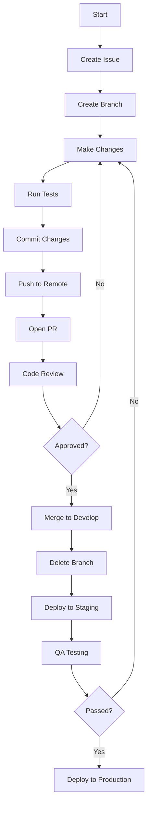

# Contributing to System Infrastructure

Welcome to the project! This guide will help you get started with the contribution process.

## Table of Contents

- [Welcome](#welcome)
  - [Project Overview](#project-overview)
  - [Why Contribute?](#why-contribute)
  - [Types of Contributions](#types-of-contributions)
    - [What We're Looking For](#what-were-looking-for)
    - [What We're Not Looking For](#what-were-not-looking-for)
    - [Getting Started](#getting-started)
    - [Advanced Contributions](#advanced-contributions)
  - [Contribution Guidelines](#contribution-guidelines)
    - [Nix-Specific Guidelines](#nix-specific-guidelines)
    - [Before You Begin](#before-you-begin)
- [Contribution Workflow](#contribution-workflow)
  - [Before You Begin](#before-you-begin)
  - [Making Changes](#making-changes)
    - [Create a Feature Branch](#1-create-a-feature-branch)
    - [Implement Your Changes](#2-implement-your-changes)
    - [Testing Your Changes](#3-testing-your-changes)
  - [Submitting Changes](#submitting-changes)
  - [After Submission](#after-submission)
- [How to Contribute](#how-to-contribute)
  - [Reporting Bugs](#reporting-bugs)
  - [Suggesting Enhancements](#suggesting-enhancements)
  - [Your First Code Contribution](#your-first-code-contribution)
- [Development Workflow](#development-workflow)
  - [Branch Naming](#branch-naming)
  - [Pull Request Process](#pull-request-process)
- [Commit Guidelines](#commit-guidelines)
  - [Commit Message Format](#commit-message-format)
  - [Commit Types](#commit-types)
  - [Examples](#examples)
- [Code Style and Standards](#code-style-and-standards)
- [Getting Help](#getting-help)
- [Code of Conduct](#code-of-conduct)
- [License](#license)

## Welcome

### Project Overview

This repository contains the NixOS configuration for our infrastructure, implementing a declarative approach to system management. The mission of this project is to create reproducible, maintainable, and secure system configurations that can be version-controlled and easily deployed across different environments.

### Why Contribute?

By contributing to this NixOS configuration, you can:
- Help build robust, reproducible infrastructure using Nix/Flakes
- Gain experience with modern NixOS practices and module development
- Learn about system configuration as code and infrastructure automation
- Improve the reliability and security of the systems
- Contribute to a project that values declarative and reproducible infrastructure

### Types of Contributions

We welcome various types of contributions, organized from general to specific:

#### What We're Looking For

**1. Code Contributions**
- New NixOS modules and configurations
- Bug fixes and performance improvements
- Test coverage enhancements
- Security hardening

**2. Documentation**
- API and module documentation
- Tutorials and how-to guides
- Code examples and recipes
- Translation of documentation

**3. Testing & Quality**
- Bug reports with reproduction steps
- Test case additions
- Performance benchmarking
- Security audits

**4. Community Support**
- Answering questions
- Triaging issues
- Code reviews
- Mentoring new contributors

#### What We're Not Looking For
- Breaking changes without discussion
- Untested or undocumented code
- Non-backward compatible changes without migration paths
- Contributions that don't follow our code of conduct

#### Getting Started
For new contributors, we recommend starting with:
1. Documentation improvements
2. Good first issues
3. Test coverage improvements
4. Small bug fixes

#### Advanced Contributions
For experienced contributors, consider:
- New module development
- Performance optimizations
- Security enhancements
- Complex feature implementations

### Contribution Guidelines

To ensure a smooth contribution process, please note:

#### What We're Looking For
- Well-tested Nix expressions and modules
- Clear, documented configurations with examples
- Backward compatibility for existing systems
- Solutions that follow NixOS best practices
- Properly formatted commit messages following our guidelines

#### Nix-Specific Guidelines
- Use flakes for development and deployment
- Follow the Nixpkgs manual and module system conventions
- Keep configurations modular and reusable
- Document all public interfaces and options
- Include appropriate type annotations for module options

#### Before You Begin
- Check existing issues and PRs to avoid duplicates
- For significant changes, open an issue first to discuss
- Ensure your changes align with our project goals and roadmap

## Contribution Workflow

### Before You Begin
- Check existing issues and PRs to avoid duplicates
- For significant changes, open an issue first to discuss
- Ensure your changes align with our project goals and roadmap

### Making Changes

#### 1. Create a Feature Branch
```bash
# Create and switch to a new branch
# Example for a new authentication feature
git checkout main
git pull origin main
git checkout -b feat/user-authentication

# Or for a bug fix
git checkout -b fix/login-error-404

# Or for documentation updates
git checkout -b docs/update-api-docs
```

#### 2. Implement Your Changes

**Example: Adding a New NixOS Module**
```nix
# Example: modules/my-service.nix
{ config, lib, pkgs, ... }:

with lib;

let
  cfg = config.services.myService;
in {
  options.services.myService = {
    enable = mkEnableOption "My custom service";
    port = mkOption {
      type = types.port;
      default = 8080;
      description = "Port to run the service on";
    };
  };

  config = mkIf cfg.enable {
    systemd.services.my-service = {
      description = "My Custom Service";
      wantedBy = [ "multi-user.target" ];
      serviceConfig = {
        ExecStart = "${pkgs.my-package}/bin/my-service --port ${toString cfg.port}";
        Restart = "always";
        User = "my-service";
      };
    };
    
    users.users.my-service = {
      isSystemUser = true;
      group = "my-service";
    };
    users.groups.my-service = {};
  };
}
```

**Example: Modifying an Existing Service**
1. Locate the relevant module in `nixpkgs` or your local modules
2. Create an override or extension:
   ```nix
   # Example in configuration.nix or a module
   { config, lib, ... }: {
     services.nginx = {
       enable = true;
       recommendedGzipSettings = true;
       recommendedOptimisation = true;
       
       # Add custom configuration
       appendHttpConfig = ''
         # Custom nginx configuration
         server_tokens off;
         add_header X-Frame-Options DENY;
       '';
     };
   }
   ```
3. Test the changes in a VM or sandbox:
   ```bash
   nixos-rebuild build-vm -I nixos-config=./configuration.nix
   ```
4. Update documentation if the change affects configuration options

#### 3. Testing Your Changes

> **Note:** Comprehensive testing documentation is currently under development. The following provides basic guidance, and we're working on expanding this section with detailed testing strategies and examples.

**Basic Testing Commands**

> **Note:** Under development.

**Testing Best Practices**
1. Always test configuration changes in a VM or on a non-production system first
2. Use `nixos-option` to verify configuration values
3. Check system logs with `journalctl` after making service changes

We're actively developing more comprehensive testing documentation, including:
- Unit testing for Nix modules
- Integration testing strategies
- Automated testing in CI/CD pipelines
- Property-based testing examples

Please check back soon for updates, or consider contributing to our testing documentation.

### Submitting Changes

#### 1. Push Your Changes
```bash
# Add changed files
git add .

# Commit with a descriptive message
git commit -m ":sparkles: feat(auth): add user authentication middleware"

# Push to your fork
git push -u origin your-branch-name
```

#### 2. Open a Pull Request
1. Go to the [Pull Requests](https://github.com/your-org/system/pulls) page
2. Click "New Pull Request"
3. Set base branch to `develop` and compare with your feature branch
4. Fill in the PR template with details about your changes

**Example PR Title**:
```
✨ feat(auth): add user authentication middleware
```

**Example PR Description**:
```markdown
## Description
Adds JWT-based authentication middleware for API endpoints

## Related Issues
Fixes #123

## Testing
- [x] Added unit tests
- [x] Tested manually with Postman
- [ ] Updated documentation

## Screenshots (if applicable)
[Add screenshots or screen recordings if relevant]
```

#### 3. Code Review Process
- Automated checks (CI/CD) will run
- Maintainers will review your code
- Address any feedback or requested changes
- Update your branch with `git pull --rebase origin develop` if needed

#### 4. After Approval
- A maintainer will squash and merge your PR
- Your changes will be included in the next release
- The PR will be automatically closed

### After Submission

#### Monitoring Your PR
- Check the "Checks" tab for CI/CD pipeline status
- Monitor email notifications for review comments
- If tests fail, push fixes to the same branch

#### Common Issues and Solutions

**1. Merge Conflicts**
```bash
git fetch origin
git rebase origin/develop
# Resolve conflicts, then
git add .
git rebase --continue
```

**2. Failing Tests**
- Check the test output in the CI logs
- Run tests locally to reproduce:

> **Note:** Under development.

**3. Code Review Feedback**
- Address all comments by pushing new commits
- For discussions, use the "Resolve conversation" button
- If you disagree with feedback, explain your reasoning

#### After Merge
- Delete your feature branch
- Update your local develop branch:
  ```bash
  git checkout develop
  git pull origin develop
  git branch -d your-feature-branch
  ```
- Celebrate your contribution! 🎉
- Consider sharing your experience with the community

## How to Contribute

### Reporting Bugs

- Use GitHub Issues to report bugs
- Include steps to reproduce the issue
- Describe the expected behavior vs. actual behavior
- Include version information (OS, dependencies, etc.)
- Add appropriate labels to the issue

### Suggesting Enhancements

- Open an issue describing the enhancement
- Explain why this enhancement would be useful
- Include any relevant technical details or implementation ideas
- Use the "enhancement" label

### Your First Code Contribution

1. Find an issue labeled `good first issue` or `help wanted`
2. Comment on the issue that you'd like to work on it
3. Follow our [Development Workflow](#development-workflow)

## Development Workflow

### Commit Message Guidelines

We follow the [Conventional Commits](https://www.conventionalcommits.org/) specification with Gitmoji for all commit messages. This ensures a consistent commit history and enables automated changelog generation.

#### Commit Message Format

```
:gitmoji: type(scope?): subject

[optional body]

[optional footer(s)]
```

## Commit Guidelines

We strictly follow the [Conventional Commits](https://www.conventionalcommits.org/) specification with [Gitmoji](https://gitmoji.dev/) for all commit messages. This combination ensures a consistent, readable commit history and enables automated changelog generation.

### Commit Message Structure

```
:gitmoji: type(scope?): subject

[optional body]

[optional footer(s)]
```

### Components Explained

1. **Gitmoji (Required)**
   - Visual indicator at the start of the commit
   - Must be one of the [official Gitmoji](https://gitmoji.dev/)
   - Should be semantically related to the change type
   - No space between the emoji and the type

2. **Type (Required - Conventional Commit Type)**
   - Must be one of the standard Conventional Commit types:
     - `feat`: New feature (✨)
     - `fix`: Bug fix (🐛)
     - `docs`: Documentation changes (📝)
     - `style`: Code style/formatting (🎨)
     - `refactor`: Code refactoring (♻️)
     - `perf`: Performance improvements (⚡️)
     - `test`: Adding or fixing tests (✅, 🚨)
     - `chore`: Maintenance tasks (🔧, ⬆️, etc.)
   - Must be lowercase
   - Must immediately follow the Gitmoji (no space after the emoji)

3. **Scope (Optional)**
   - Must be a noun describing a section of the codebase
   - Must be in parentheses
   - Must immediately follow the type
   - Should be lowercase with hyphen-separated words if needed

4. **Subject (Required)**
   - Brief description of the change (max 72 characters)
   - Must use imperative mood ("add" not "added" or "adds")
   - No period at the end
   - Must be separated from type/scope by a colon and space (`: `)


### Gitmoji to Conventional Commit Mapping

| Gitmoji | Conventional Type | When to Use | Example |
|---------|-------------------|-------------|---------|
| ✨ | `feat` | New features or functionality | `✨ feat(auth): add OAuth login` |
| 🐛 | `fix` | Bug fixes | `🐛 fix(api): handle null user data` |
| ♻️ | `refactor` | Code changes that neither fix bugs nor add features | `♻️ refactor(utils): optimize data processing` |
| 📝 | `docs` | Documentation changes | `📝 docs(readme): update installation guide` |
| 🎨 | `style` | Code style/formatting | `🎨 style: format code with prettier` |
| ⚡️ | `perf` | Performance improvements | `⚡️ perf(render): optimize component rendering` |
| ✅ | `test` | Adding or updating tests | `✅ test(auth): add login test cases` |
| 🚨 | `test` | Fixing failing tests | `🚨 test: fix flaky test in user service` |
| 🚧 | `wip` | Work in progress (use sparingly) | `🚧 wip: implement checkout flow` |
| 🚑 | `fix` | Critical hotfixes | `🚑 fix(auth): patch security vulnerability` |
| 🔒 | `fix` | Security-related fixes | `🔒 fix(security): update dependencies with CVEs` |
| 🚀 | `chore` | Deployment/CI changes | `🚀 chore(ci): update deployment pipeline` |
| ⬆️ | `chore` | Dependency updates | `⬆️ chore(deps): update react to v18.2.0` |
| 🔧 | `chore` | Configuration changes | `🔧 chore(config): update webpack config` |
| 🚚 | `chore` | File/folder structure changes | `🚚 chore: move components to shared folder` |
| 🗃️ | `chore` | Database changes | `🗃️ chore(db): add users table migration` |
| 🍱 | `chore` | Adding/updating assets | `🍱 chore(assets): add new icons` |

### Special Cases

| Gitmoji | Conventional Type | Usage | Example |
|---------|-------------------|-------|---------|
| 🍻 | - | Only for initial commit | `🍻 Initial commit` |
| 🔥 | `chore` | Removing code/files | `🔥 chore: remove deprecated endpoints` |
| 🏷️ | `chore` | Version tags | `🏷️ chore: v1.2.0` |
| 🔍 | `chore` | SEO improvements | `🔍 chore(seo): add meta tags` |
| 💄 | `style` | UI/style changes | `💄 style(ui): update button colors` |
| ♿️ | `perf` | Accessibility improvements | `♿️ perf(a11y): improve screen reader support` |

### Breaking Changes

For breaking changes, add `BREAKING CHANGE:` in the footer or body of the commit message, followed by a description of what changed and how to migrate:

```
:boom: feat(api): remove deprecated API

BREAKING CHANGE: The deprecated API endpoint `/v1/old` has been removed.
Please use `/v2/new` instead.
```

### Examples

#### Feature with scope
```
✨ feat(auth): add OAuth2 login
```

#### Bug fix with body and footer
```
🐛 fix(api): handle null user data

Prevent null reference exception in user endpoint
when user data is not found in the database.

Fixes #123
```

#### Chore with scope
```
⬆️ chore(deps): update react to v18.2.0
```

#### Breaking change
```
💥 feat(api): remove deprecated endpoints

BREAKING CHANGE: The following deprecated endpoints have been removed:
- GET /api/v1/old-endpoint
- POST /api/v1/legacy

Please use the new v2 API endpoints instead.
```

### Best Practices

1. **Be Consistent**
   - Use the same type/scope for similar changes
   - Keep the same style throughout the project

2. **Be Specific**
   - Use scopes to indicate which part of the code is affected
   - Keep the subject line clear and concise

3. **Use the Body for Context**
   - Explain what changed and why
   - Include any relevant background information

4. **Reference Issues**
   - Use `Fixes #123` or `Closes #123` to automatically close issues
   - Reference related issues in the body

5. **Keep It Atomic**
   - Each commit should represent a single logical change
   - Split large changes into smaller, focused commits

### Examples

```
✨ feat(auth): add login with GitHub

Add OAuth integration with GitHub for user authentication.
Closes #123

- Implemented OAuth2 flow
- Added user model updates
- Updated documentation
```

```
🐛 fix(api): handle null response in user endpoint

Prevent null reference exception when user data is not found.
Fixes #456
```

## Visual Workflow Overview



### Common Scenarios

#### 1. Starting a New Feature
1. Create a new branch from `develop`
2. Implement feature following TDD (Test-Driven Development)
3. Write documentation and examples
4. Update CHANGELOG.md
5. Submit PR for review

#### 2. Fixing a Bug
1. Reproduce the bug with a test
2. Fix the issue
3. Add regression tests
4. Document the fix in CHANGELOG.md
5. Submit PR with `fix:` prefix

#### 3. Updating Dependencies
1. Check for outdated packages:
   ```bash
   pip list --outdated
   ```
2. Update requirements files
3. Test thoroughly
4. Document breaking changes
5. Submit PR with `chore(deps):` prefix

### Branch Naming

Use the following format for branch names:

```
type/descriptive-name
```

Where `type` is one of:
- `feat` - New feature
- `fix` - Bug fix
- `docs` - Documentation changes
- `style` - Code style updates
- `refactor` - Code changes that neither fix bugs nor add features
- `test` - Adding missing tests or correcting existing tests
- `chore` - Maintenance tasks

### Commit Message Guidelines

We follow [Conventional Commits](https://www.conventionalcommits.org/) with [Gitmoji](https://gitmoji.dev/) for all commit messages. This ensures a consistent commit history and enables automated changelog generation.

#### Commit Message Format

```
:gitmoji: type(scope?): subject

[optional body]

[optional footer(s)]
```

#### Gitmoji Types

| Emoji | Code | Description |
|-------|------|-------------|
| ✨ | `:sparkles:` | Introduce new features |
| 🐛 | `:bug:` | Fix a bug |
| 📝 | `:memo:` | Add or update documentation |
| ♻️ | `:recycle:` | Refactor code |
| 🚧 | `:construction:` | Work in progress |
| 🔧 | `:wrench:` | Add or update configuration |
| ✅ | `:white_check_mark:` | Add or update tests |
| 🚀 | `:rocket:` | Deploy stuff |
| 🔒 | `:lock:` | Fix security issues |
| ⬆️ | `:arrow_up:` | Upgrade dependencies |
| ⬇️ | `:arrow_down:` | Downgrade dependencies |
| 🎨 | `:art:` | Improve structure/format of the code |
| ⚡️ | `:zap:` | Improve performance |
| 🔥 | `:fire:` | Remove code or files |
| 🚚 | `:truck:` | Move or rename files |
| 📦 | `:package:` | Add or update compiled files or packages |
4. Ensure all tests pass
5. Submit a pull request to the `develop` branch
6. Reference any related issues in your PR description
7. Request review from maintainers
8. Address any review feedback

## Code Style and Standards

Please refer to our comprehensive [CODESTYLE.md](CODESTYLE.md) document for detailed guidelines on:

- General coding standards and best practices
- Language-specific style guides (Python, etc.)
- Documentation standards and examples
- Testing guidelines and examples
- Git commit message conventions
- Pull request guidelines
- Code review checklist

All contributors are expected to follow these standards to maintain code quality and consistency across the project.

## Getting Help

If you have any questions or need assistance, please open an issue in the repository. The maintainer will respond as soon as possible.

### Recognition

All contributions, big and small, are valued and appreciated. Significant contributions may be recognized in release notes.

## Code of Conduct

This project is committed to fostering a welcoming and respectful environment for all contributors. All participants are expected to follow standard professional conduct.

## License

By contributing, you agree that your contributions will be licensed under the project's [LICENSE](LICENSE) file.

---
*This document was inspired by [The Good Docs Project](https://thegooddocsproject.dev/) and other open source contributing guides.*