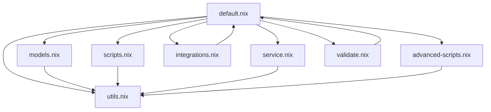

# 🤖 Ollama Module for Home-Manager

A simple NixOS/nix-darwin module for running Large Language Models (LLMs) locally using [Ollama](https://ollama.ai).

> **Note**: This module has been refactored following SOLID, DRY, KISS, and YAGNI principles for better maintainability and simplicity.

## 📋 Table of Contents

- [Installation](#-installation)
- [Configuration](#-configuration)
- [Usage](#-usage)
- [Model Management](#-model-management)
- [Optional Features](#-optional-features)
- [Module Architecture](#-module-architecture)

## ✨ Features

- **🚀 Automatic Service Management**: Systemd user service with auto-start
- **📦 Declarative Model Management**: Define models in your Nix configuration
- **🎯 Model Presets**: Pre-configured sets of common models
- **⚡ Hardware Acceleration**: Support for Metal (macOS), CUDA, and ROCm
- **🛠️ Essential CLI Tools**: Interactive chat and code assistant

## 📦 Installation

The module is already included in your configuration. To enable it, add the following to your home configuration:

```nix
{
  applications.terminal.tools.ollama.enable = true;
}
```

## ⚙️ Configuration

### Basic Configuration

```nix
{
  applications.terminal.tools.ollama = {
    enable = true;
    
    # Models to install automatically
    models = [ "llama3.2" "codellama" "mistral" ];
    
    # Or use presets
    modelPresets = [ "general" "coding" ];
  };
}
```

### Advanced Configuration

```nix
{
  applications.terminal.tools.ollama = {
    enable = true;
    
    # Hardware acceleration (auto-detected for macOS)
    acceleration = "metal";  # Options: "none", "metal", "cuda", "rocm"
    
    # Environment variables
    environmentVariables = {
      OLLAMA_NUM_PARALLEL = "2";
      OLLAMA_MAX_LOADED_MODELS = "2";
      OLLAMA_KEEP_ALIVE = "5m";
    };
    
    # Optional features
    shellAliases = true;
    integrations.zed = true;
    advancedScripts.enable = true;  # RAG, API client, benchmarking
  };
}
```

## 🚀 Usage

### Basic Commands

```bash
# Run a model interactively
ollama run llama3.2

# Use configured aliases (when shellAliases = true)
ai "Tell me a joke"
ai-code "Write a Python function to sort a list"

# Service management
ollama-status   # Check service status
ollama-restart  # Restart service
ollama-logs     # View logs

# Model management
ollama list     # List installed models
ollama ps       # Show running models
ollama pull llama3.1:70b  # Pull new model
```

## 🛠️ Available Commands

### Core Tools

#### 🗨️ **ollama-chat** - Simple Chat Interface
```bash
ollama-chat [model]

# Example:
ollama-chat llama3.2
# Type 'exit' to quit
```

#### 💻 **ollama-code** - Code Assistant
```bash
ollama-code [model] "prompt"

# Examples:
ollama-code "Write a Python function to sort a list"
ollama-code codellama "implement a binary tree in Rust"
```

## 📦 Model Management

### Model Presets

| Preset | Models | Use Case |
|--------|--------|----------|
| `general` | llama3.2, mistral | General chat and text |
| `coding` | codellama, deepseek-coder | Code generation |
| `small` | phi3, tinyllama | Resource-efficient |

```nix
{
  applications.terminal.tools.ollama.modelPresets = [ "general" "coding" ];
}
```

### Manual Model Management

```bash
# Pull models
ollama pull llama3.2
ollama pull codellama

# Update all models
ollama-update
```

## 🔌 Optional Features

### Zed Editor Integration

```nix
{
  applications.terminal.tools.ollama.integrations.zed = true;
}
```

### Advanced Scripts

```nix
{
  applications.terminal.tools.ollama.advancedScripts.enable = true;
}
```

This enables:
- **ollama-rag**: Document Q&A system
- **ollama-api**: Direct API client
- **ollama-benchmark**: Model performance testing

### API Access

The Ollama API is available at `http://localhost:11434`:

```bash
curl http://localhost:11434/api/tags
```

## 🔧 Troubleshooting

### Service Issues

```bash
# Check service status
ollama-status

# View logs
ollama-logs

# Restart service
ollama-restart
```

### Model Issues

```bash
# Check available space
df -h ~/.ollama

# Retry model download
ollama pull llama3.2
```

### Performance Tuning

```nix
{
  applications.terminal.tools.ollama.environmentVariables = {
    OLLAMA_NUM_PARALLEL = "1";         # Reduce parallel requests
    OLLAMA_MAX_LOADED_MODELS = "1";    # Limit loaded models
    OLLAMA_KEEP_ALIVE = "1m";          # Reduce timeout
  };
}
```

## 📚 Resources

- [Ollama Documentation](https://github.com/ollama/ollama)
- [Model Library](https://ollama.ai/library)

## 🏗️ Module Architecture

This module follows a modular architecture with clear separation of concerns:

```
ollama/
├── default.nix          # Main module configuration
├── utils.nix           # Common utilities and constants
├── models.nix          # Model presets and management
├── scripts.nix         # Essential CLI tools (chat, code)
├── service.nix         # Systemd service configuration
├── integrations.nix    # Optional editor integrations
├── advanced-scripts.nix # Optional advanced tools (RAG, API, benchmark)
├── validate.nix        # Configuration validation script
└── README.md           # This documentation
```

### Design Principles Applied

- **SOLID**: Each module has a single responsibility
- **DRY**: Common utilities extracted to prevent duplication
- **KISS**: Focus on essential functionality, complex features are optional
- **YAGNI**: Advanced features disabled by default

### Module Dependencies



## 🤝 Contributing

Follow the project's [contributing guidelines](../../../../../CONTRIBUTING.md) when making changes to this module.

### Adding New Features

1. **Core features**: Add to appropriate existing module
2. **Optional features**: Create new module and import in `default.nix`
3. **Scripts**: Add to `scripts.nix` for essential tools, `advanced-scripts.nix` for optional ones
4. **Utilities**: Add common functions to `utils.nix`

### Testing Changes

```bash
# Validate syntax and build
just darwin-build wang-lin

# Test module functionality
ollama-validate
```